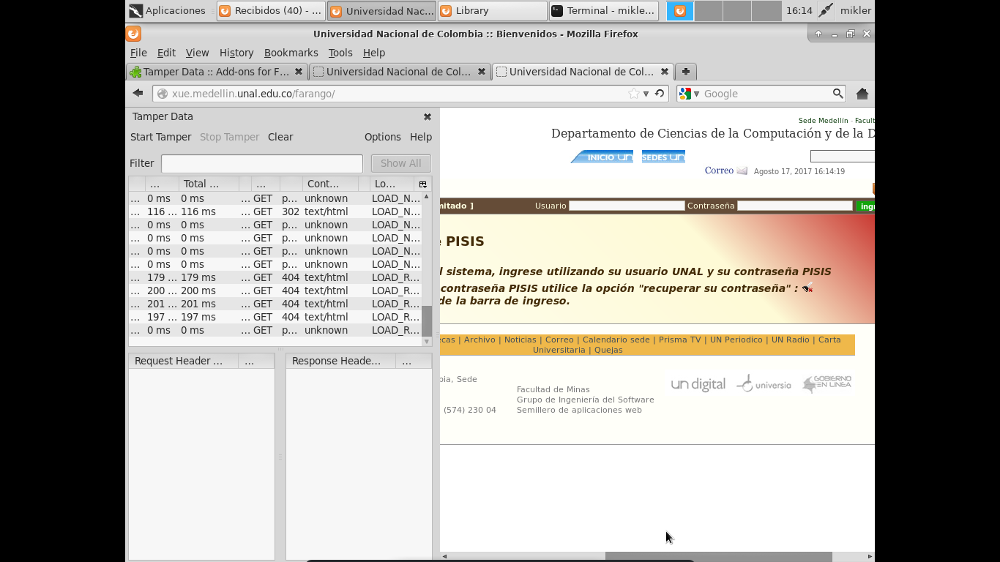
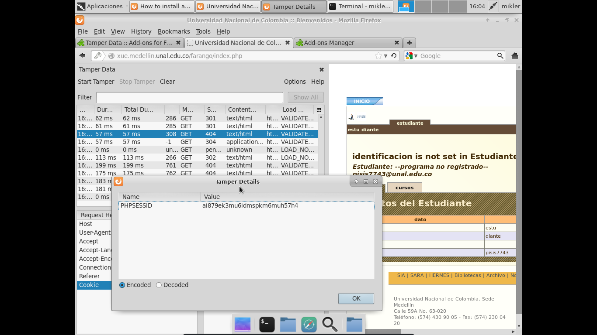
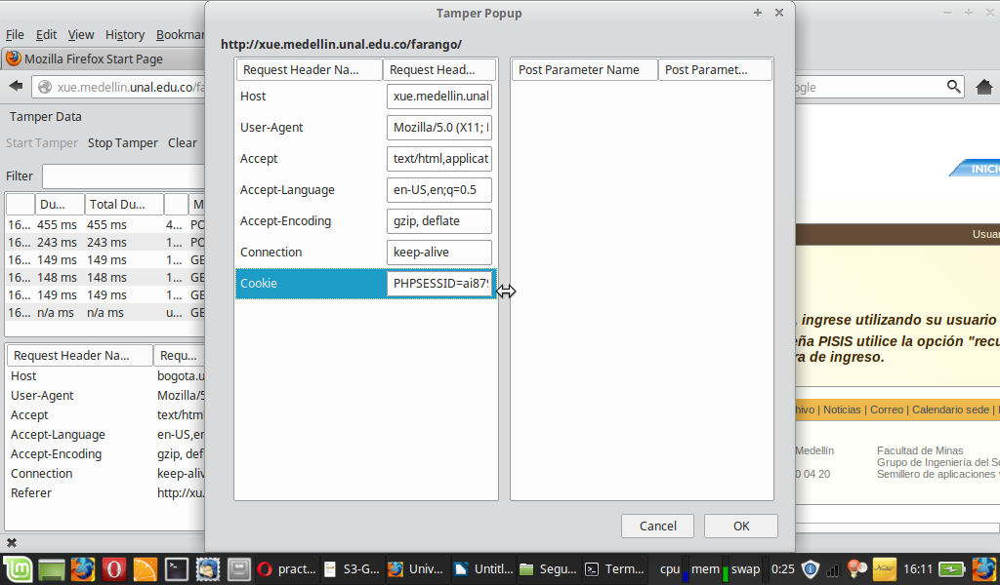
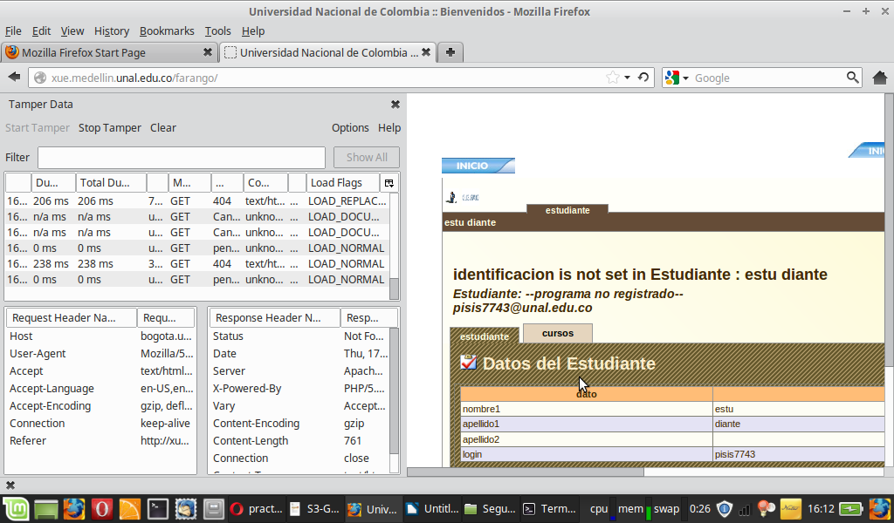
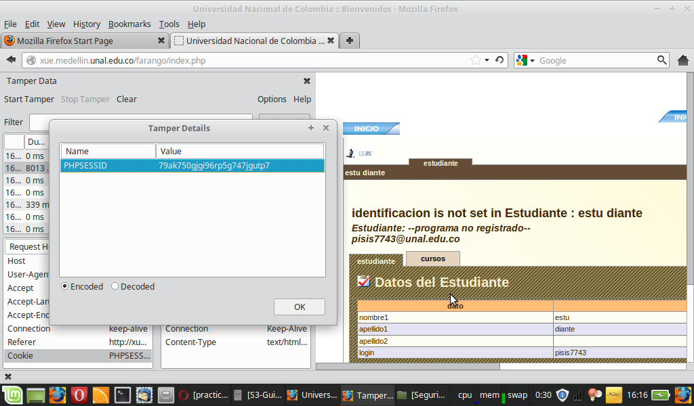
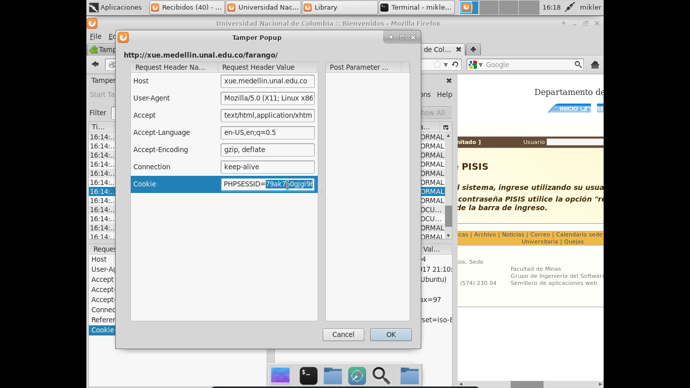
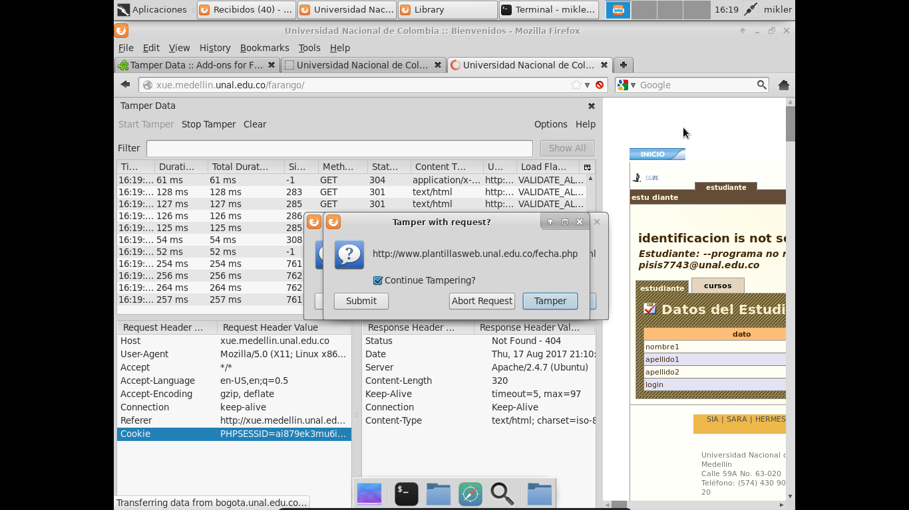

# Tamper Data #

* tamper data is complemnet use with firefox version 16.
> Use tamperdata to view and modify HTTP/HTTPS headers and post parameters.
Trace and time http response/requests.
Security test web applications by modifying POST parameters.

## kali- mint ##

PHPSESSID -> ai879ek3mu6idmspkm6muh57h4 machine local

## mint - kali ##

PHPSESSID other machine -> 79ak750gjgi96rp5g747jgutp7

