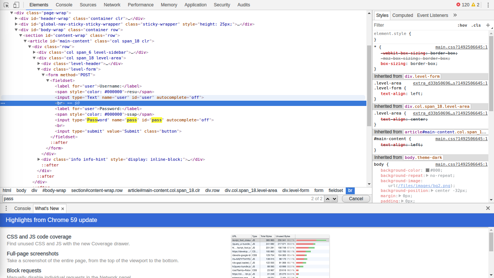

# S2 ago(7-11)  Hackthis #
### level 2 ###
First all show hint and understand
>Just expanding on the idea of Level 1. The best place to start is always the source code.
 Or maybe the answer is right under your nose?!

1. ctrl+u : read code
1. in the browser ctrl-f for filter words key: maybe into source code find words password, username
1. __! bingo ¡:__  




* username :

``` html
 <span style="color: #000000">resu</span>
```

* password:

``` html
  <span style="color: #000000">ssap</span>
```
## Main level 3 ##

show hint and understand
> Using JavaScript as the only method to secure your site is a bad idea, but this has obviously been over looked while coding this page.

1. ctrl+u : read html code
1. ctrl + shift + c : Developer tools
1. search in html code with words that are in the paragraph of the help, syntax JavaScript
1. proven methods previously seen
1. prove with key words : password , username, finality __pass__ . is winer
1. use ctrl+f , filter search

```JavaScript
 $(function(){ $('.level-form').submit(function(e){ if(document.getElementById('user').value == 'heaven' && document.getElementById('pass').value == 'hell') { } else { e.preventDefault(); alert('Incorrect login') } })})
```


__"Storing confidential information anywhere in the source code is BAD, no matter if it is in the HTML or JS.__

__ANY code that runs on client-side can be altered or skipped entirely. This is why it is important to validate user data on the server even if it has been checked by JS."__


## main level 4 ##
>Sometimes extra hidden fields are added to the form which contains extra information for the login script. Again this is very easy for anyone to gain access to as it is clearly shown in the source code.
Sometimes these fields can contain very important information.

1. ctrl + shift + c
1. read and think
1.  ctrl-f for searcher quick
1. find with word hidden that this in paragraph help
``` html
<input type="hidden" name="passwordfile" value="../../extras/ssap.xml">
```

 * get into in url with value
 * www.hackthis.co.uk/levels/extras/ssap.xml


## main level 5 ##
> Slightly more complicated JavaScript this time, but just as insecure.
  Refresh to try again.

* prove in input after click button
* ctrl + u, read code
* filter key words `<script>` is javascript code into html
* is slow because it touches the entire html file

```JavaScript
var pass;
 pass=prompt("Password","");
 if (pass=="9286jas") {
     window.location.href="/levels/main/5?pass=9286jas";
 }
```
## main level 6 ##
>This page is coded to only let in one user (Ronald). But there is no Ronald?! You will need to find a way to add him to the list.

* inspect element, edit html code
* select , option, change value


# DVWA #

* screen capture kali


* lampp


* DVWA


