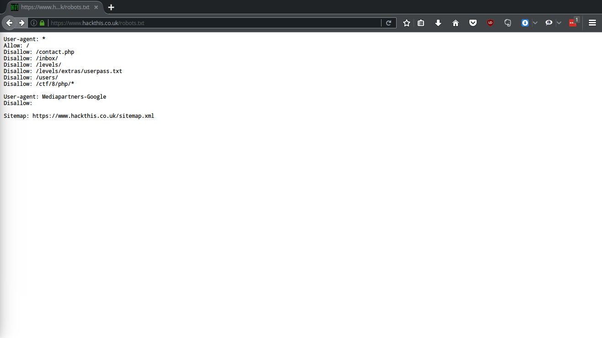
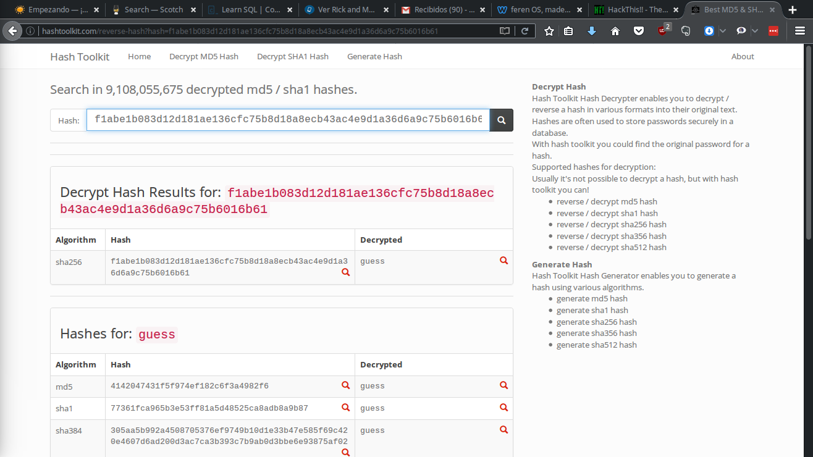

# Google Dorks #
### Camera the security ###
* Multimedia files:
 1. camera linksys inurl:main.cgi
 1. inurl: "ViewerFrame?Mode="
 1. "active webcam page" inurl:8080
 * SQL dumps
  1. filetype:inc intext:mysql_connect password-please -could -port
* .txt files containing
  1. hackthis filetype:txt "robots"

# 3 extra points . #
##   7 Hackthis :  ##
* find in google : ' hackthis filetype:txt "robots" '
* 
* inside in url : https://www.hackthis.co.uk//levels/extras/userpass.txt
we will find pass(u3qh458) y user (48w3756)

##   8 Hackthis :  ##
**show hint**
>The coder has made the same mistake as level 4 but this time at least he has tried to protect the password. The password has been encrypted, convert the binary into something that is easier for humans to read (base 16).

>If you think you have the right answer but it isn't being accepted, submit your answer in CAPITALS.


  *html*
```
<input name="passwordfile" value="extras/secret.txt" type="hidden">
```


`1011 0000 0000 1011` *B     0    0    B*

`1111 1110 1110 1101` *F   E    E   D*

##   9 Hackthis :  ##
**show hint** : _The developer has now added a feature that allows him to get a password reminder. Can you exploit it to send you the login details instead?_

in value gmail valid
```
<input name="email2" id="email2" value="miller@gmail.com" autocomplete="off" type="hidden">
```
write igual in Email input

## 10 Hackthis ##

html
```
<input name="passwordfile" value="level10pass.txt" type="hidden">
```

